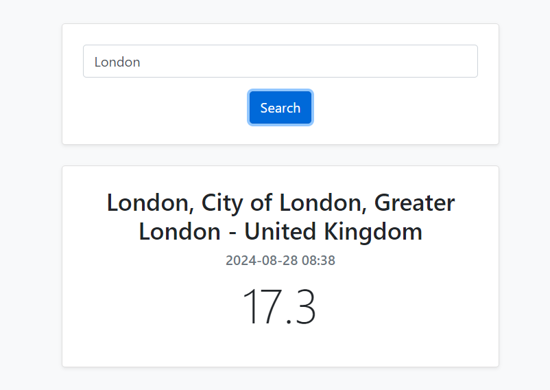

# ClimateCheck 

A simple weather application that fetches and displays the current weather information for any city using the WeatherAPI. The app allows users to input a city name and view its corresponding weather details, including the city name, local time, and temperature.

## Preview


## Table of Contents
- [Features](#features)
- [Technologies Used](#technologies-used)
- [Setup and Installation](#setup-and-installation)
- [Usage](#usage)
- [License](#license)

## Features
- **City Search**: Enter a city name to fetch real-time weather data.
- **Weather Display**: Shows the city name, local time, and temperature.
- **Responsive Design**: Uses Bootstrap for a mobile-friendly and responsive layout.

## Technologies Used
- **HTML**: Structure of the web page.
- **CSS**: Custom styles separated into a `styles.css` file.
- **Bootstrap**: For responsive design and basic UI components.
- **JavaScript**: Handles the API request and updates the DOM with weather data.
- **WeatherAPI**: External API service to fetch weather information.

## Setup and Installation

### Prerequisites
- A modern web browser (Google Chrome, Firefox, etc.).
- An internet connection to fetch weather data from the API.

### Installation Steps
1. **Clone the Repository**:
   ```bash
   git clone https://github.com/yourusername/weather-app.git
   ```
   Or download the ZIP file and extract it.

2. **Navigate to the Project Directory**:
   ```bash
   cd weather-app
   ```

3. **Open `index.html` in your Browser**:
   You can directly open the `index.html` file in any web browser to use the app.

## Usage
1. **Enter a City Name**: Type the name of any city in the input box.
2. **Click 'Search'**: Hit the "Search" button to fetch and display the weather details.
3. **View the Results**: The app will display the city's name, local time, and current temperature.


## License
This project is licensed under the MIT License. See the [LICENSE](LICENSE) file for details.
```

   
